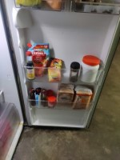
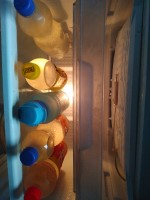
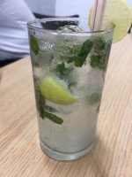
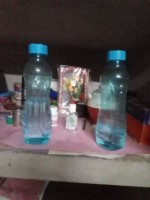
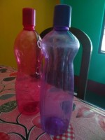
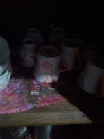
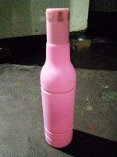
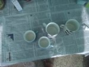
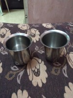

# Bottles and Cups Image Dataset   

This dataset consists of images of bottles and cups.

**Introduction**    
Dataset consists of images of bottle and cups captured using mobile phones in real-world scenario. Images were captured under wide variety of indoor lighting conditions. This dataset can used for detection of a wide variety of bottles and cups made up of variety of materials from a lot of different of view-points, locations, orientation, etc.    

**Dataset Features**  
* Captured by 3000+ unique users  
* Captured using mobile phones    
* Variety of different material of bottles and cups   
* HD Resolution    
* Highly diverse  
* Various lighting conditions  
* Indoor scenes     

**Dataset Format**  
* Classification and detection annotations available   
* COCO, PASCAL VOC and YOLO formats  
* Approx. 4000 unique images  

**Sample Images**  
          

# Datacluster Labs Datasets

Datacluster Labs focuses on Crowd Data Collection through our managed crowd-sourcing platform - [Dailydata](https://play.google.com/store/apps/details?id=com.daily.data). 

We provide integrated services for your AI needs:  
* Data Collection  
* Data Curation  
* Data Annotation 

We deal with all types of multimedia data collection and annotation like images, videos, audio, text and surveys.

**To download full datasets or to submit a request for your dataset needs, please contact **contact@datacluster.in****  

To download the full datasets, please contact [contact@datacluster.in](contact@datacluster.in).  
Visit [www.datacluster.in](www.datacluster.in) to know more.
    

**Note:**  
**All the images are manually verified and are contributed by the large contributor base on our platform.** 